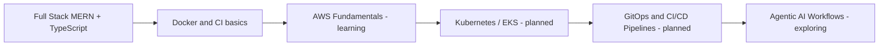

# Hi, I'm Ali Akbar

## About Me
Full Stack JavaScript / TypeScript developer focused on the MERN stack. I build web applications, SaaS features, and REST APIs, and I'm currently expanding into cloud infrastructure and DevOps practices.

## What I Build
- SaaS application features and internal tools
- REST APIs with authentication, role-based access, and data modeling
- E-commerce backends and admin/CMS platforms
- Real-time features (chat, notifications) using Node.js
- Frontend interfaces with React and Next.js
- Third-party API and service integrations (payments, auth providers, cloud services)

## Tech Stack

**Currently learning:**

## Featured Work

<strong>mern-infra</strong> — Modular MERN monorepo with Docker and CI

**Tech:** Node.js, Express, React, TypeScript, Docker, pnpm workspaces, GitHub Actions

**Highlights:**
- Monorepo structure with shared packages across API and web apps
- Role-based access control (RBAC) for a social application
- Containerized with Docker; includes a CI workflow and pull request history

**Repository:** [aliakbarlive/mern-infra](https://github.com/aliakbarlive/mern-infra)

<strong>Node.js E-commerce API Boilerplate</strong> — Node.js + TypeScript e-commerce API boilerplate

**Tech:** Node.js, TypeScript, Express, MongoDB

**Highlights:**
- Backend-first structure for building e-commerce API modules
- Designed to be extended with authentication, products, orders, and payment workflows

**Repository:** [aliakbarlive/nodejs-ecomerce-boilerplate-typescript](https://github.com/aliakbarlive/nodejs-ecomerce-boilerplate-typescript)

<strong>e-commerce-cms</strong> — MERN e-commerce CMS

**Tech:** React, Node.js, MongoDB, TypeScript, Docker

**Highlights:**
- Admin-focused structure for managing e-commerce workflows
- Can be extended with roles, inventory, order tracking, and third-party integrations

**Repository:** [aliakbarlive/e-commerce-cms](https://github.com/aliakbarlive/e-commerce-cms)

<strong>chat_app</strong> — Real-time MERN chat application

**Tech:** Node.js, Express, MongoDB, Socket.io

**Highlights:**
- Real-time communication flow between users
- Can be extended with authentication, message persistence, read receipts, and notifications

**Repository:** [aliakbarlive/chat_app](https://github.com/aliakbarlive/chat_app)

## Currently Learning
I'm building toward platform engineering: containerized deployments, CI/CD pipelines, and AWS fundamentals, alongside exploring agentic AI tooling. This is a growth area, not a current specialty.

## How I Work
- I write TypeScript where possible for maintainability.
- I document setup and environment configuration in every project README.
- I use Git branches and pull requests even on solo projects to keep a clean history.
- I'm comfortable working directly with clients on SaaS, API, and dashboard projects.

## Contact

